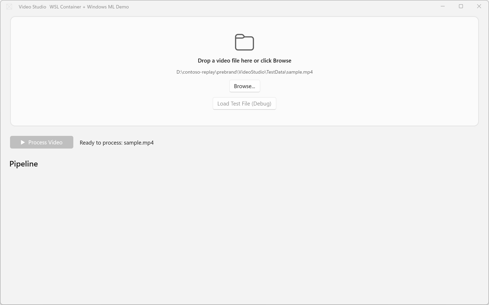
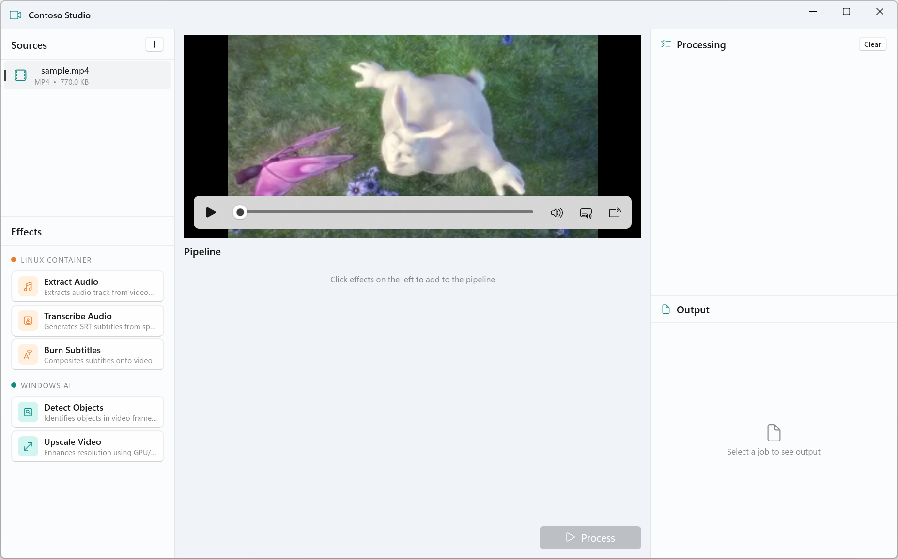
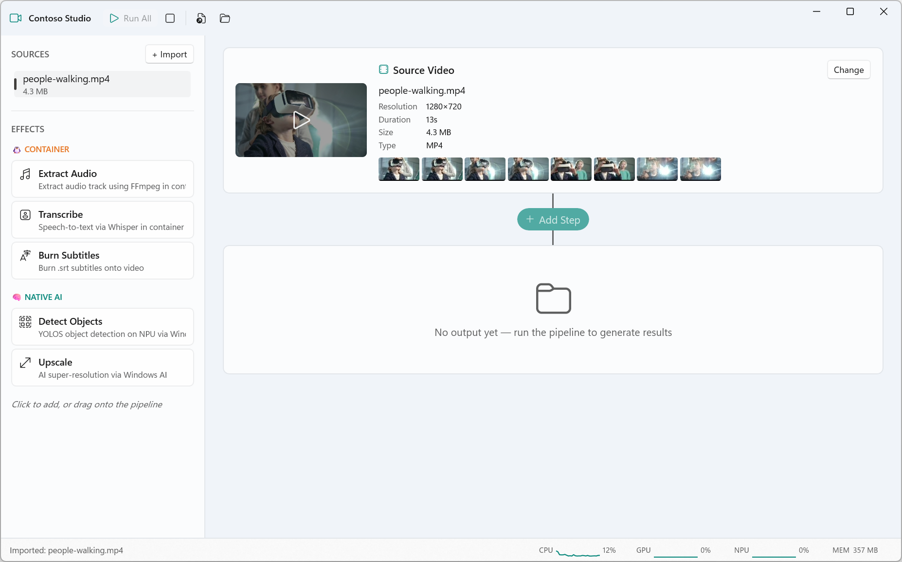
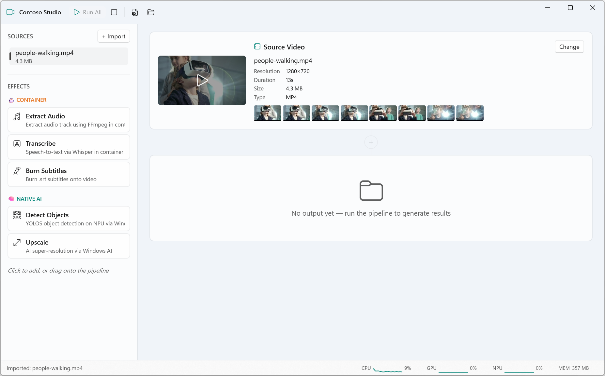
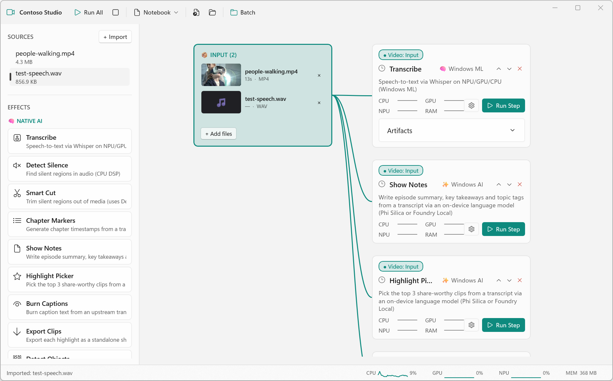
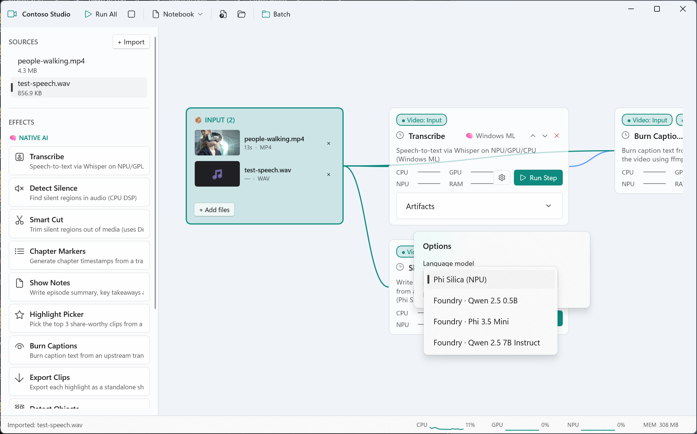

+++ layout = "center"

# From Prompt to App

## Build AI-powered apps on Windows

+++

# From Prompt to App

@column

> Lei Xu, 
> Program Manager

@column

> Nikola Metulev, 
> Software Engineer

+++ layout = "center", notes = "One line. Set the frame. The whole talk is about building and iterating on real Windows apps with agents."

# Agenda

@click
## Act 1 - Build with Agents

@click
## Act 2 - Make it real with AI platform integrations

+++ layout = "center", notes = "The first prompt. Generic video studio sample-app shell."

{width=95%, height=75%}

> i was thinking of building a media application that uses a combination of ml models and media processing in containers… could I ask you to think about some realistic things we could do for the container side?

+++ layout = "center", notes = "Iterating on layout — first commit."

{width=95%, height=75%}

> right now it looks like a sample app — can we make it look like a real brand, can we design some ideas?

> can we have a nice preview/live playback… the titlebar is broken… nice drag and drop of effects… the panes need more separation. can we move things around — sources top, effects bottom, full progress on the right…

+++ layout = "center", notes = "New UI direction: notebook for video processing."

{width=95%, height=75%}

> I'm not excited about this. could we redo the ui and try a thing like a Jupiter notebook, but for video processing? Build your own pipeline with steps you can add, remove, move around, and see input/output directly inline.

+++ layout = "center", notes = "YOLO ONNX inference on the NPU via Windows ML + QNN."

{width=95%, height=75%}

> we need to make this as real as possible. let's try to get the yolo effect working and please use the ui-testing skill to debug until it works.

+++ layout = "center", notes = "Switching to a DAG — outputs lead to multiple inputs."

{width=95%, height=75%}

> the linear flow doesn't make sense - let's rethink this to be an actual tree where outputs lead to multiple inputs into effects which can take multiple inputs? 

+++ layout = "center", notes = "Pluggable LLM backend — Phi Silica on the NPU; Foundry Local for anything else.", hidden = "true"

{width=95%, height=75%}

> for the effects that depend on phi silica, let's add a way to change the model to use things like foundry local so it can be configured?

+++ spacing = "1", notes = "1 min. Recap what makes this possible. Don't dwell — just name the pieces and tell people to try it.", hidden = "true"

# What makes this possible

@click
- **WinUI agent plugin** — Copilot skills for WinUI app development
@click
- **WinApp CLI** — packaging, identity, run, debug, UI automation
@click
- **dotnet new winui templates** — start from a real WinUI project
@click
- **winui-search, winmd-cli, Roslyn analyzers** — the small tools that fill the gaps

+++ layout = "columns", spacing = "1", notes = "1 min. Each tool maps to something a human developer already does. Agents need the same affordances we do."

# Agents need what humans need

@column

@color(gray)
### How humans build apps

- File → New
- F5 to run
- copy sample code
- IntelliSense
- stack traces, debug output
- lint
- interact with app

@column

@color(cyan)
### What agents use

- `dotnet new winui`
- `winapp run`
- `winui-search`
- `winmd-cli`
- `winapp run --debug-output`
- Roslyn analyzers
- `winapp ui`

+++ layout = "center", notes = "DEMO — 2 min. Manually: dotnet new winui, winapp run --debug-output, winui-search for a sample. Show how an agent would use the same tools.", hidden = "true"

# Demo: how agents use these tools

> dotnet new winui
> winapp run --debug-output
> winui-search

+++ spacing = "1", notes = "1 min. The APIs are what make this real. Name the platform pieces actually powering Contoso Studio."

# What makes the app real

## The platform underneath Contoso Studio

@click
- **Windows App SDK** and **WinUI** — platform integrations and native Windows UI
@click
- **Windows ML** — local models (Whisper, silence detection, classifiers)
@click
- **Windows AI APIs** — text intelligence, image, summarization
@click
- **Foundry Local** — local LLMs on the same box

@click
@color(cyan)
> Local-first. Hardware-aware. Native.

+++ layout = "center", notes = "DEMO — 5 min. Pick an effect that finishes in <5 min and uses the winml CLI. Kick off the prompt, then switch to slides while it runs.", hidden = "true"

# Demo: add a new effect

> Prompt the agent to add it. Let it cook.

+++ spacing = "1", notes = "While the prompt runs — walk the WinML CLI flow. This is the technical credibility moment.", hidden = "true"

# WinML CLI

## Optimize a model for this machine

- @link(winml/winml-cli.html, "Open the WinML CLI overview")

@click
- Pick a model
@click
- Optimize for CPU / GPU / NPU
@click
- Register it as a capability the app can use

@click
@color(cyan)
> Model  →  optimized  →  pipeline effect.

+++ layout = "center", notes = "DEMO — 2 min. Back to Contoso Studio. Hopefully the effect is done. Have a backup recording if not. Show what the agent actually changed.", hidden = "true"

# Demo: the new effect, live

> See what the agent did. Drop it into the pipeline.

+++ spacing = "1"

# Recap

@click
- **Agents** make iterating on Windows apps cheap
> POC in minutes, not days
> Change your mind cheaply
> "What if…" becomes a prompt, not a sprint
> Make it real quickly when you find the idea

@click
- **WinApp CLI + skills + templates + tools** give agents the same affordances humans have

@click
- **Windows ML + Windows AI + Foundry Local** make the app real

@click
@color(cyan)
> Windows shortens the path from prompt to product.

+++ layout = "center", notes = "ONE MORE THING. We're on a device that can run big local LLMs. Use them with the skills to do things completely offline. Demo: UI-test the app fully offline."

# One more thing

## This machine can run a big local LLM ...

+++ spacing = "1", notes = "Recap the value of iterating with agents. Quick, punchy.", hidden = "true"

# Why iterate with agents

+++ spacing = "1"

# Thank you

Visit `aka.ms/build/evals` or scan the QR code to fill out a session survey

## aka.ms/winui-skills
## aka.ms/winappcli
